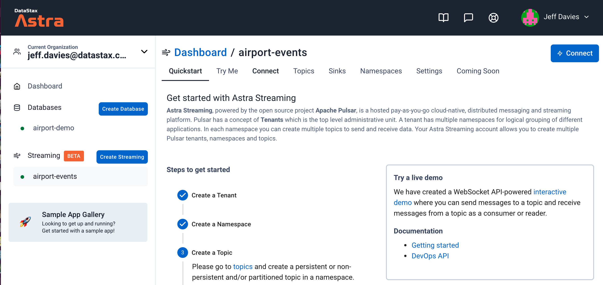
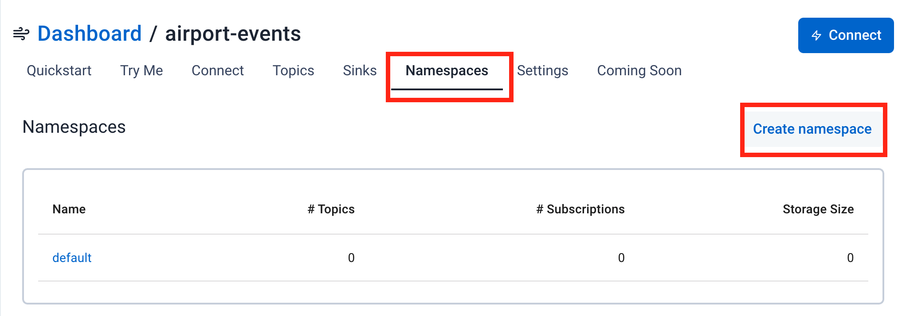
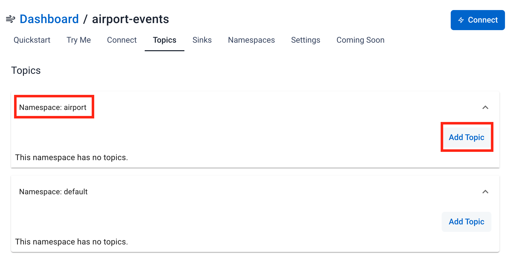
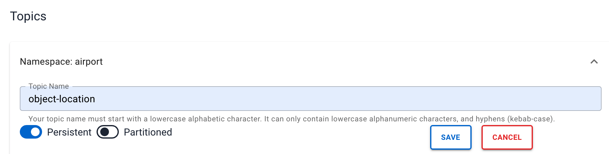
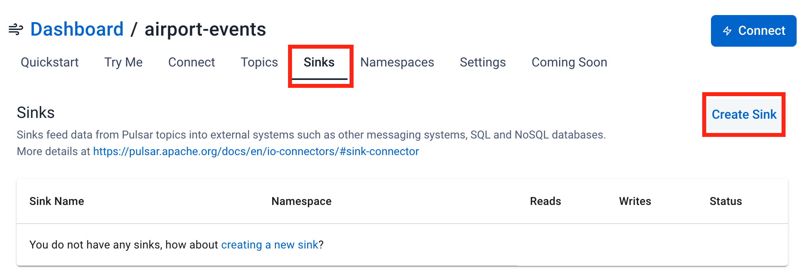
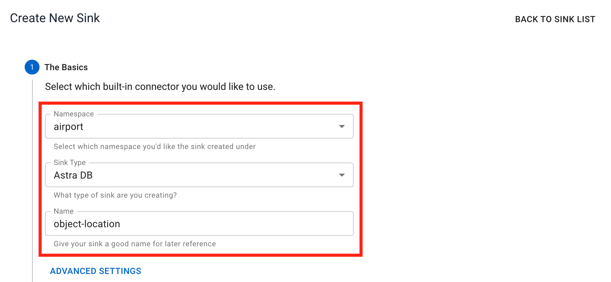
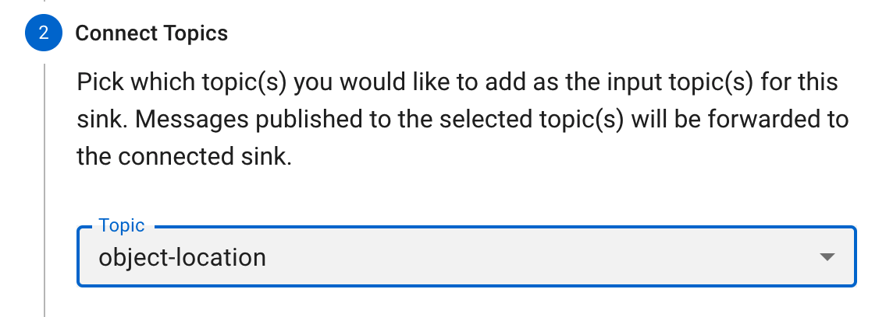
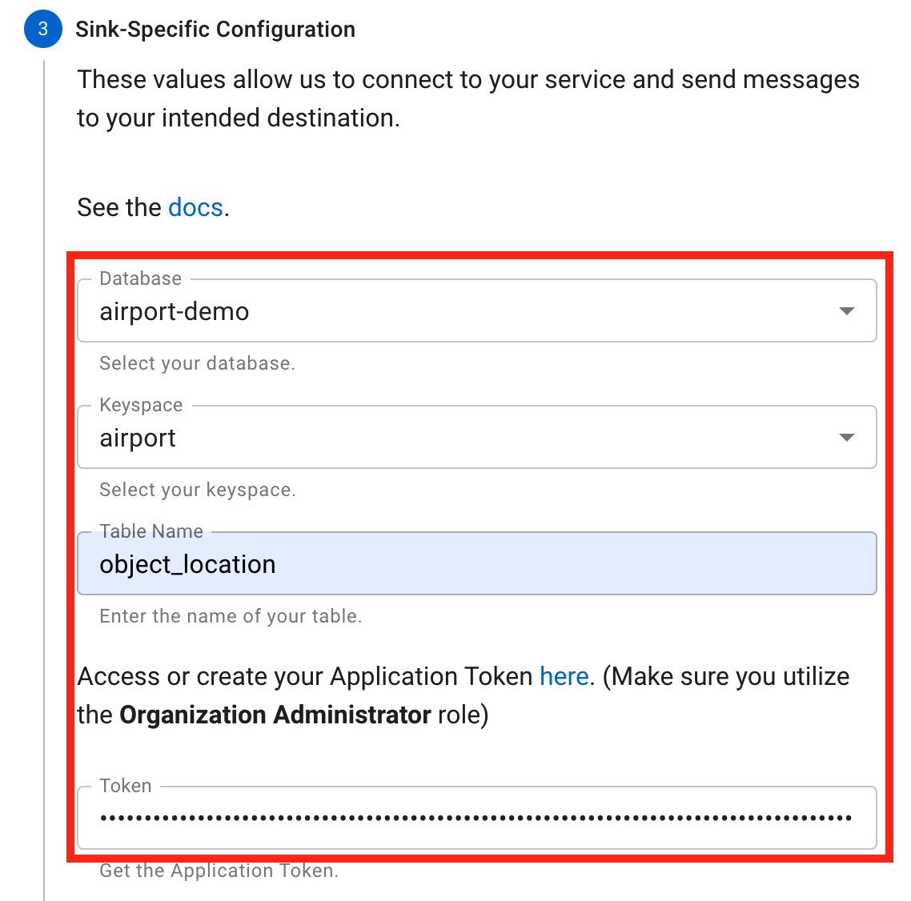
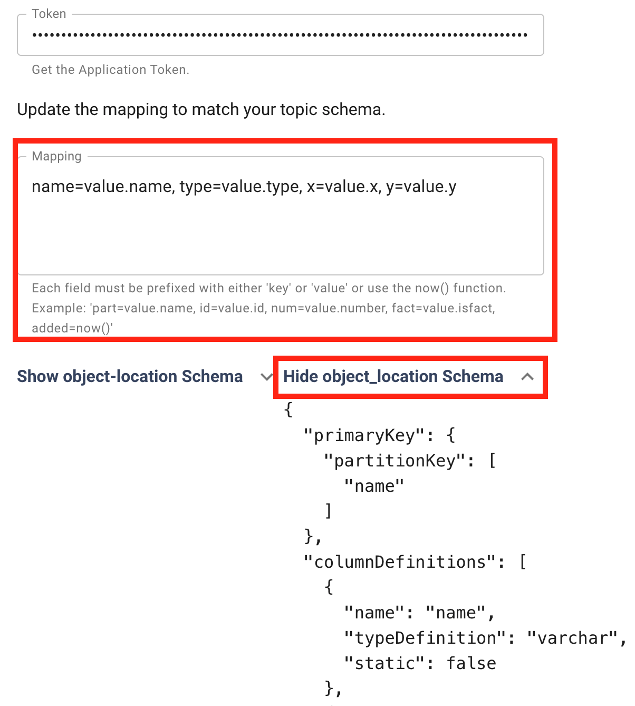
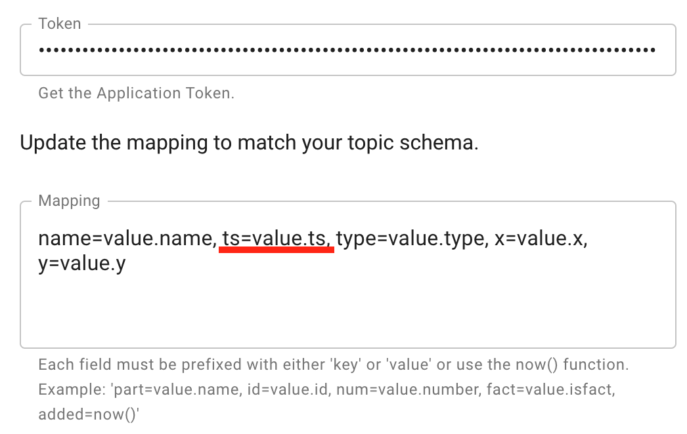

# Airport Demo

Demo of monitoring an airports airspace. All planes, gates, baggage carts, tractors, yellow gear, fuel trucks, etc.

## Architecture

The demo consists of three main parts:

1. FAA Events: This is a Pulsar instance that emulates the FAA events that are sent to each airport.
2. Database: This acts as a pulsar data-sinkto record all events
3. Application: This is a web application that is used to visualize the locations of all of the objects in the airspace. Later I would like to expand it to include windows that emulate the gate monitors.

In addition to these main parts will be a variety of tools that allow the demo presenter to create actions and influence the data flowing through pulsar. This will allow for things like gate changes for a flight, real-time baggage tracking on a customer application, etc.

### Planned Demo Scenarios

1. Watch the traffic: Be able to just watch all of the movemoent in an airport from an overhead view,allowing the viewer in zoom in and click on moving items to examine their details.
2. Modify a flights gate: Send the plane to a new gate and have the gate monitors and gate chane events fire off automatically.
3. Real Time Baggage Tracking: Allow a customer to see where their bag is (ie still in the plane, on the bagggage cart, getting loaded onto the conveyor belt or on the conveyer belt)

## Blog Entry

DataStax has recently released the Astra Streaming (read: managed Apache Pulsar) product to beta. You can create a free account at <https://astra.datastax.com> and begin testing it out. In this article, I will show you how to use Astra Streaming to not only feed information into the streaming "pipe", but also how to store those events into an Astra DB for later analisys.

In our scenario, we are using Astra Streaming to replicate the stream of object location information that is normally provided by the FAA to each airport. This stream reports the location of every piece of equipment at the airport (planes, fuel truck, aircraft tow tractors, baggage carts, etc). We want to see this information in two ways:

1. Where is everything located right now?
2. Where has a specific object been located historically? This is useful for tracking the paths of the object over time.

Instead of providing alot of theory up front, I'm going to dive right into the solution and explain things as I go along. Plus, the code will help to answer alot of questions along the way. As always, you can access all of the source code for this project at
<https://github.com/jdavies/airport-demo>.

### Create the database

Our first step will be to create the database. This is a very simple databasewith only 2 tables. I created the tables in a keyspace called ```airport``` to keep things simple. The tables in the ```airport``` keyspace are ```object_location``` whch tracks where every object is at the moment (well, really, the last known location), and the ```object_location_history``` which tracks the location of the object over time with the most recent update listed first.

If you are following along with your own Astra instance, simly create a database with the keyspace ```airport``` and the run the database/create.cql file to create your tables.

**Note:** It is possible to create your Astra Streaming on one cloud provider and have your Astra database hosted by another cloud provider. However, as you may suspect it willbe more performant if they are both hosted by the same cloud provided and they are both in the dame region.

Once you have your database created, it's time to move onto streaming!

### Create the Astra Streaming Tenant

Create a new streaming tenant in the Astra web console and name it ```airport-events```. When the tenant is fully created and running you will see a small green dot to the left  of its name and the dashboard for the tenent will show up in your browser, as shown in the following image:


*The airport-events tenant dashboard.*

### Create the Astra Streaming Namespace

This step is optional becuase there is a default namepace created for you when you create a tenant. However, I like to keep things organized and isolated so I strongly recommend that you create a namespace for the airport-demo. Click on the ```Namespaces```tab.


*Creating a namespace in Astra Streaming*

Set the namespace to ```airport``` and press the ```create``` button. It's just that easy!
### Create the Astra Streaming Topic

Our next step is to create the topic for our object location events. Click on the ```Topics``` tab in the dashboard. By default, you will see both the new```airport``` namespace and the ```default``` namespace isted in the dashboard. Click the ```Add Topic``` button in the ```airport``` namespace to create the new topic.


*Creating a topic in airport namepace*

You only need to specify the name of the topic, ```object-location``` as shown in the next image:


*Creating the object-location topic in airport namepace*

At this point we have a topic to which we can publish events. However, those events don't go anywhere just yet. Next we will create 2 "sinks" that will consume the events and store them in a database.

### Create the Astra DB object_location sinks

The mechanism that Astra Streaming uses to store events to a database is a "sink". We will need to create 2 sinks, one for each of our tables.

### Create the object-location sink

Our first sink will store the event on the object_location table. This table is different from the object_location_history table in that it does **not** have the timestamp field. Click on the ```Sinks``` tab and then press the ```Create Sink``` button.


*Creating the sink for the object_location table in our Astra DB*

In step 1 of the wizard, select the fields as shown in the following image:


*Step 1 of creatng the object-location sink*

Be sure to select the ```object-location``` topic in step 1 of the wizard.


*Step 2: Select the topic*

Next you need to provide the connectivity information for your database. All of the information is important, but the database token is probably the most critical piece here. After you havepasted your token in, press the TAB button to exit the token field. This will prompt the Astra website to introspect your database and table and generate the field mappings, as you will see next.


*Step 3: Specify the database you want to use*

The field mapping is done automatically for you. I have yet to find a condition where the automatic mapping is incorrect, but it never hurts to check twice! Also, you can now expand the area for the message schema and view the details there.


*Step 3: Notice the field mapping is autmatically generated for you.*

Press the ```Create``` button to create the sink.

### Create the object-location-history sink

Now to create our second sink, the ne that will capture information into the object_location_history table. You will perform essentially the same steps that you did for the first sink, with some key differences:

Sink Name: objloc-history (names are limited to 18 characters)
Topic: Pick the object-location topic again. It will feed both of our tables!
Table Name: object_location_history

This time when you enter the database token and TAB out of the field, the mapping wil appear a little differently:


*Notice the field mapping is sightly different for this sink*

You see here the ```ts``` or **timestamp** field is included in the mapping. Press the ```Create``` button to create this sink.

### Create a Java Producer

Things that generate topic messages are call ```producers``` in Apache Pulsar (and by extension in Astra Streaming). We need to create a producer that will send messages to the object-location topic. In fact, we don't want to send simple string messages like many of the Pulsar "Hello World" level examples do. We want to send an ojbect that can be stores in a database table(s).

If you take a look at the Java code in the <https://github.com/jdavies/airport-demo/tree/main/pulsar/skyview/src/main/java/com/datastax/pulsar> folder on the GitHub project